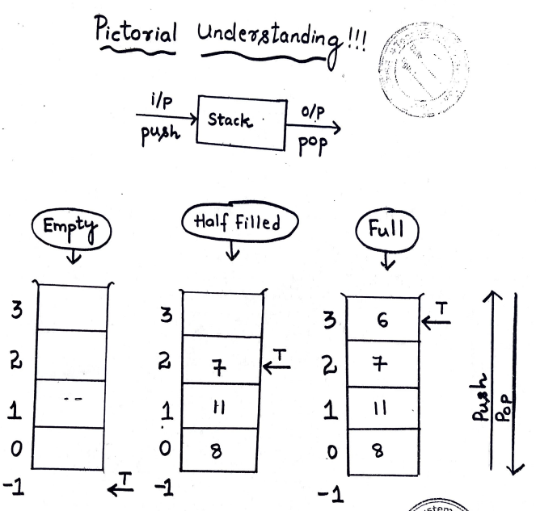

# Stack in C

Interfaces 

- createNewStack()
    - To store data
    - Type and capacity to be specified
- IsStackEmpty()
    - To check if stack is empty
    - pop() not allowed
- isStackFull()
    - To check if stack is full
    - push() is not allowed
- push()
    - To push data
    - Data to be passed
- pop()
    - To get the data
    - container to be passed